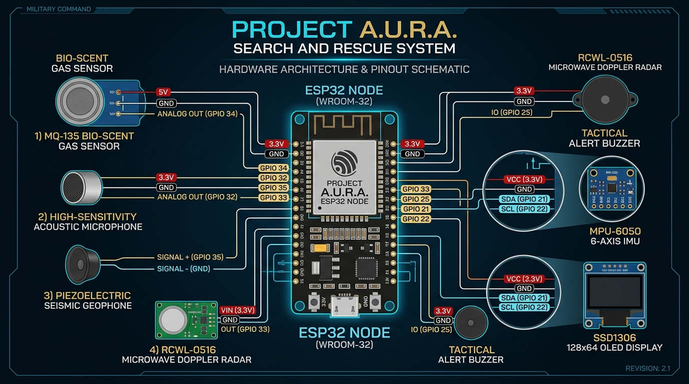

# A.U.R.A. // Sub-Surface Cavity & Life Detection System




> **Bridging the gap between first responders and life trapped beneath disaster rubble. Zero unmapped survivors.**

---

## 📌 Executive Summary

**A.U.R.A. (Sub-Surface Cavity & Life Detection System)** is a real-time tactical intelligence and scrollytelling web interface built for emergency disaster response teams. During structural collapses (earthquakes, explosions, and tunnel cave-ins), traditional aerial drones and thermal sensors fail to scan through dense concrete and steel layers. A.U.R.A. translates subterranean acoustic tapping patterns and ultrasonic depth anomalies into actionable 3D locational coordinates for rescue personnel.

---

## 🔌 Hardware Architecture & Microcontroller Firmware

The complete hardware schematic diagram is embedded above (`public/aura_hardware_architecture.jpg`).

- **Hardware Diagram:** [`public/aura_hardware_architecture.jpg`](./public/aura_hardware_architecture.jpg)
- **ESP32 Microcontroller Firmware:** [`firmware/esp32_aura_node.ino`](./firmware/esp32_aura_node.ino)
- **Hardware Connection Guide:** [`HARDWARE_TECH_PARTS.md`](./HARDWARE_TECH_PARTS.md)

---

## ⚡ Key Features

- **8K Frame-Scrubbing Canvas Engine:** Smooth 60fps scrollytelling rendering of high-resolution subsurface scan sequences mapped directly to viewport scroll position.
- **ESP32 Edge Firmware Integration:** Real C++ micro-controller code for reading Piezoelectric geophones and Ultrasonic depth sensors (`firmware/esp32_aura_node.ino`).
- **Real-Time Telemetry Feed:** Embedded live python scanner simulation (`aura_telemetry_feed.py`) displaying depth variance parsing.
- **Deep Space Galaxy Transition:** Seamless visual transition from subterranean tunnel scans to deep space optics at the footer reveal.
- **Responsive Tactical UI:** Built with custom white-glassmorphic typography, smooth scroll animations, and interactive scramble hover effects.

---

## 📂 Project Structure

```
c:/AURA WEBSITE/
├── firmware/
│   └── esp32_aura_node.ino  # ESP32 C++ Microcontroller Source Code
├── public/
│   ├── aura_hardware_architecture.jpg  # Hardware Wiring Connection Diagram
│   └── high_res_frames/               # 311 Extracted High-Resolution 4K Frames
├── src/
│   ├── App.tsx              # Main Application & Scrollytelling Engine
│   ├── main.tsx             # React DOM Mounting Entrypoint
│   └── index.css            # Tailwind v4 directives & keyframe animations
├── PROBLEM_STATEMENT.md     # In-depth analysis of disaster search-and-rescue blindspots
├── HARDWARE_TECH_PARTS.md   # Step-by-step wiring instructions & pinouts
├── README.md                # Main GitHub repository landing portfolio
└── package.json             # Dependencies and build scripts
```

---

## 👥 Core Architecture Team

| Name | Role | Focus Area |
| :--- | :--- | :--- |
| **Jaffer Rilwaan V** | Lead Systems Architect | System Logic, Telemetry Integration & Flow |
| **Hannah Blessy J** | Hardware & Sensor Lead | Piezoelectric Hardware Arrays & Signal Logic |
| **Gurudev Kumaravel** | Telemetry & Cloud Engineer | Secure Telemetry Broadcasting & Cloud Network |
| **Aravind Kumar** | Firmware Engineer | Microcontroller Logic & Real-time Filters |
| **Priyanka Mohan** | UI/UX Developer | High-Tech Command Dashboard & Components |

---

© 2026 A.U.R.A. All Rights Reserved. Built for Hackathon Deployment.
