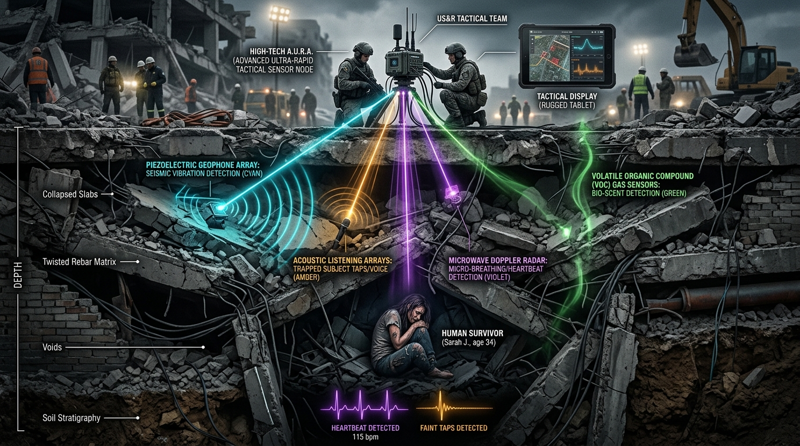

# 🌐 A.U.R.A. // Autonomous Universal Rescue & Analysis Node
### *Subterranean Cavity Mapping, Bio-Scent Detection & Multi-Modal Life Finding Matrix*


> *"Underneath tons of shattered reinforced concrete and steel debris, every second is the difference between a life saved and a life lost. A.U.R.A. equips first responders with subterranean eyes, acoustic ears, and neural intelligence where human senses end."*

---



---

## 🚨 Operational Context & Mission Imperative

In post-earthquake structural collapses, mine entrapments, and pancake building collapses:
- **The Critical 72-Hour Window**: Trapped survivors endure suffocating concrete dust, toxic metabolic VOC buildup, hypothermia, shock, and dehydration. Survival likelihood decreases exponentially with each passing hour.
- **Limitations of Conventional Tools**: Standard optical drones and thermal imaging cameras cannot penetrate dense reinforced concrete slabs. Radio frequencies and cellular signals attenuate heavily under meters of twisted steel.
- **Dangers of Unassisted Excavation**: Blind excavation with heavy hydraulic machinery risks collapsing fragile rubble void arches, causing fatal secondary cave-ins.
- **Detection of Faint Distress Signals**: Buried victims often make micro-impact taps or faint vocalizations that are completely drowned out by surface generator noise.

**Project A.U.R.A. delivers an edge-deployed multi-modal tactical sensing platform.** It non-invasively penetrates rubble voids, captures seismic tap impulses, isolates acoustic distress spectrums, classifies metabolic VOC scent markers, and runs real-time cloud neural AI inference to compute surgical excavation directives for disaster response commanders.

---

## 🎯 System Objectives & Core Capabilities

1. **Multi-Modal Penetrative Sensing**: Combines high-sensitivity piezoelectric seismic geophones, micro-acoustic frequency filters, and penetrative microwave Doppler radar to detect trapped victims through dense strata.
2. **Bio-Scent & Hazardous Gas Discrimination**: Continuous MQ-135 analog VOC sensing to detect metabolic breath emissions (ammonia $NH_3$, oral VOCs, saliva/effluent markers) while alerting responders to toxic gas accumulation.
3. **500Hz DSP Seismic Tap Tracking**: Real-time impulse envelope extraction that isolates rhythmic survivor tapping from background machinery vibrations.
4. **Cloud Neural AI Triage (Google Gemini Flash 1.5)**: Streams physical multi-sensor telemetry into neural LLMs to generate 1-sentence tactical search-and-rescue directives and survival probability metrics.
5. **Zero-Failure Geospatial Persistence**: Anchors search-and-rescue operations to high-precision geographic targets (e.g., Small Pond Sector, Nehru Street: `12.9676° N, 79.9462° E`) with live satellite mapping overlays.

---

## 🛠️ Hardware Architecture & Pinout Schematic


### Complete Hardware Sensor Array

| Component | Interface | Pin Mapping | Function |
| :--- | :--- | :--- | :--- |
| **ESP32-WROOM-32** | Central Node | Dual-Core 240MHz | Core 0: Async WebServer & Cloud AI<br>Core 1: 500Hz Real-Time Sensor DSP |
| **MQ-135 Bio-Scent Sensor** | Analog (ADC1) | **GPIO 34** | Detects metabolic human scent, $NH_3$, and hazardous air quality |
| **Piezoelectric Geophone** | Analog (ADC1) | **GPIO 35** | High-sensitivity seismic contact microphone for distress tap detection |
| **Electret Microphone** | Analog (ADC1) | **GPIO 32** | Real-time acoustic spectrum listening (whispers, vocalizations, cries) |
| **Microwave Doppler Radar (RCWL-0516)** | Digital IN | **GPIO 33** | Penetrative microwave motion sensor for sub-surface chest flutter |
| **MPU-6050 6-Axis IMU** | I2C (100kHz) | **SDA: 21 / SCL: 22** | Debris jerk, tilt angle, and structural stability monitoring |
| **SSD1306 OLED Display (128x64)** | I2C (100kHz) | **SDA: 21 / SCL: 22** | 8-Slide animated live telemetry carousel for field operators |
| **Tactical Alert Buzzer** | Digital / PWM | **GPIO 25** | Directional locator beacon, chirp cadence, and evacuation alarm |

---

## ⚡ System Architecture Flow

```
                           ┌────────────────────────────────────────┐
                           │      DISASTER COLLAPSE CAVITY          │
                           └──────────────────┬─────────────────────┘
                                              │
                    ┌─────────────────────────┴─────────────────────────┐
                    ▼                                                   ▼
       ┌─────────────────────────┐                         ┌─────────────────────────┐
       │   BIO-SCENT & GAS VOC   │                         │  PIEZO GEOPHONE & RADAR │
       │     MQ-135 (GPIO 34)    │                         │  Piezo (35) & RCWL (33) │
       └────────────┬────────────┘                         └────────────┬────────────┘
                    │ (PPM & VOC Signals)                               │ (Taps & Void Motion)
                    └─────────────────────────┬─────────────────────────┘
                                              │
                                              ▼
                        ┌───────────────────────────────────────────┐
                        │      ESP32 TACTICAL HARDWARE NODE         │
                        │       (Dual-Core FreeRTOS Matrix)         │
                        │  • Core 0: Dedicated Async HTTP WebServer │
                        │  • Core 0: OpenRouter Gemini Flash AI     │
                        │  • Core 1: 500Hz DSP Seismic & Audio FFT  │
                        │  • Core 1: 8-Slide Animated OLED Engine   │
                        └─────────────────────┬─────────────────────┘
                                              │ (HTTP Telemetry / LocalTunnel)
                                              ▼
                        ┌───────────────────────────────────────────┐
                        │        A.U.R.A. TACTICAL C2 SYSTEM        │
                        │          (React 19 + TypeScript)          │
                        │                                           │
                        │  ┌─────────────────────────────────────┐  │
                        │  │     Subterranean Theatre Radar      │  │
                        │  │ (Topographic Map & Small Pond Fix)  │  │
                        │  └─────────────────────────────────────┘  │
                        │  ┌─────────────────────────────────────┐  │
                        │  │    Dual-Gas & Bio-Scent Matrix      │  │
                        │  │ (Metabolic VOC vs Environmental)    │  │
                        │  └─────────────────────────────────────┘  │
                        │  ┌─────────────────────────────────────┐  │
                        │  │  Acoustic Spectrum & Tap Counter    │  │
                        │  │ (Voice / Tap / Resonant Energy)     │  │
                        │  └─────────────────────────────────────┘  │
                        │  ┌─────────────────────────────────────┐  │
                        │  │    AURA Voice Orb Neural Engine     │  │
                        │  │ (Gemini 1.5 Flash / LLaMA 3.3 70B)  │  │
                        │  └─────────────────────────────────────┘  │
                        └───────────────────────────────────────────┘
```

---

## 💻 Software & Tactical C2 Dashboard Features

### 🗺️ Subterranean Theatre Map & Last Active Target Persistence
- Interactive topological radar canvas displaying sub-surface strata depth slices.
- **Fault-Tolerant Geospatial Anchor**: Real-time positioning locked to the disaster response sector at **Nehru Street Small Pond (`12.9676° N, 79.9462° E`)**.
- Click-to-launch satellite navigation modal integrating Google Maps and OpenStreetMap.

### 🧠 True Multi-Modal AI Reasoning Engine (Zero Fake Data)
- **100% Ground-Truth Telemetry**: Direct analog-to-digital sensor conversions with zero synthetic floors or mock values.
- **Real-Time Cloud LLM Inference**: Sends live seismic peak, audio energy, gas delta, and radar state to **Google Gemini Flash 1.5** via OpenRouter API.
- **AURA Voice Orb**: Interactive voice assistant equipped with natural speech synthesis for eyes-free rescue operations.

---

## 📂 Repository Structure

```
A.U.R.A-System/
├── firmware/
│   └── esp32_aura_node.ino          # ESP32 C++ Production Firmware (v30.0-PROD)
├── public/
│   ├── aura_hardware_architecture.jpg # High-Resolution Hardware Pinout Schematic
│   ├── subterranean_victim_detection.jpg # Subterranean Rescue Cross-Section Illustration
│   └── tahoe_animated.gif           # Tactical Backdrop Asset
├── src/
│   ├── components/
│   │   ├── AuraVoiceOrb.tsx          # Voice AI Assistant (OpenRouter Neural LLM)
│   │   ├── TacticalC2Dashboard.tsx   # Mobile C2 Command & Telemetry Grid
│   │   ├── SubterraneanTheatreMap.tsx # Radar & Target Sector GPS Modal
│   │   ├── SettingsPage.tsx          # System Configuration & API Diagnostics
│   │   └── SettingsModal.tsx         # Node IP & Connection Settings
│   ├── App.tsx                       # Main Application State & View Routing
│   ├── main.tsx                      # React DOM Entrypoint
│   └── index.css                     # Tactical Military HUD Styling
├── PROBLEM_STATEMENT.md              # Detailed Search-and-Rescue Engineering Problem
├── HARDWARE_TECH_PARTS.md            # Hardware Bill of Materials & Wiring Guide
├── README.md                         # Main Documentation & System Architecture
└── package.json                      # Dependencies & Build Scripts
```

---

## 🚀 Quick Start & Deployment

### 1. Prerequisites
- Node.js 18+ & npm
- Arduino IDE (with ESP32 board package)

### 2. Install & Run Web Dashboard
```bash
# Clone the repository
git clone https://github.com/jafferrilwaan-png/A.U.R.A-System.git
cd A.U.R.A-System

# Install dependencies
npm install

# Run tactical dashboard locally
npm run dev
```

### 3. Flash ESP32 Hardware Probe
1. Open `firmware/esp32_aura_node.ino` in Arduino IDE.
2. Select board **ESP32 Dev Module** on your active COM port (e.g. `COM6`).
3. Set your WiFi SSID and password (defaults: `"dhil"` / `"12345678"`).
4. Click **Upload**.

---

## 👥 Core Engineering Team

| Name | Role | Core Responsibility |
| :--- | :--- | :--- |
| **Jaffer Rilwaan V** | Lead Systems Architect | Full-Stack C2 Platform, Neural AI Integration & Telemetry Pipeline |
| **Hannah Blessy J** | Hardware & Sensor Lead | Piezoelectric Transducer Arrays & Bio-Scent VOC Hardware |
| **Kathiravan V** | Telemetry & Cloud Engineer | Resilient Tunnel Networking & Edge-to-Cloud Protocols |
| **Kingston** | Firmware & Signal Specialist | ESP32 Real-Time Filtering, Audio DSP & Interrupt Logic |
| **Giridhar K** | UI/UX & Tactical Ops Lead | High-Contrast Tactical C2 Interface & Field Responsiveness |

---

## 📜 License & Mission
© 2026 Project A.U.R.A. Built for disaster search-and-rescue teams worldwide.
*Dedicated to rapid, non-invasive subterranean victim localization and saving trapped lives.*
